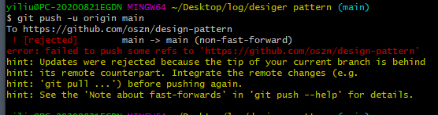
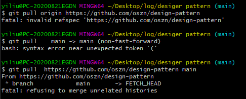
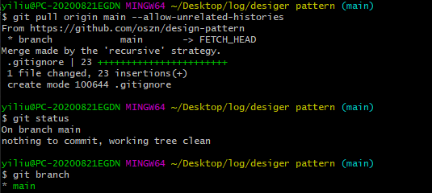
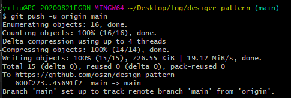
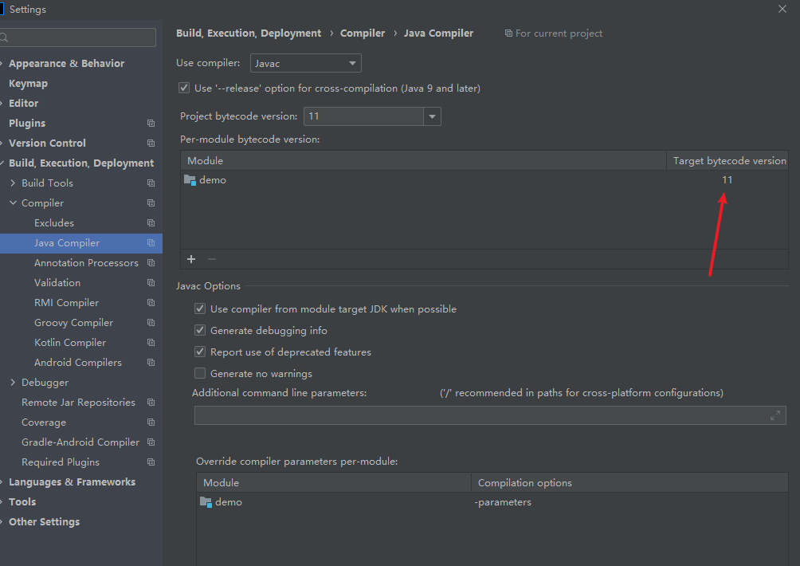
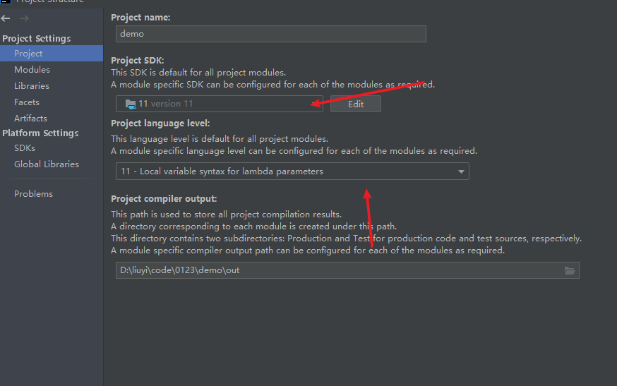
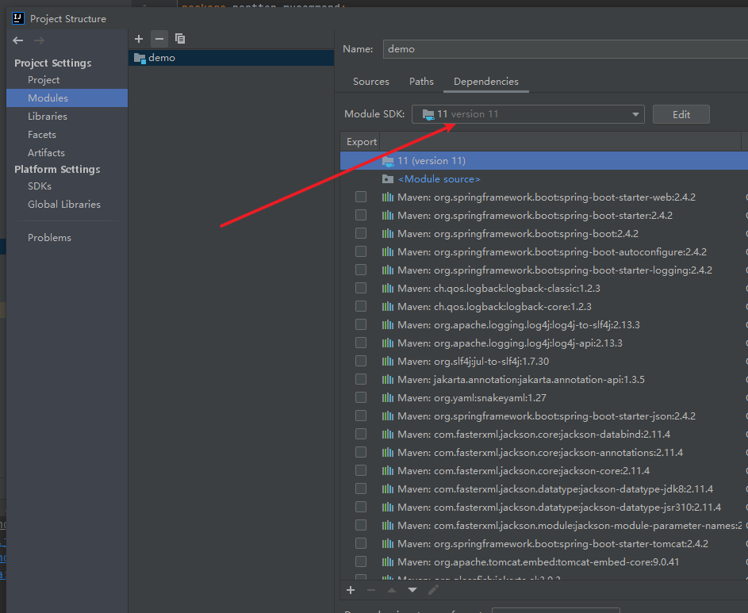

# erorr

## git

**! [rejected]        main -> main (non-fast-forward)**

error: failed to push some refs to 'https://github.com/oszn/design-pattern'

不过出现了以下的问题

**fatal: refusing to merge unrelated histories**

然后在搜索得到

可以看到main分支没了，状态也ok了，ingored文件也下下来了。

是不是很奇怪，之前都是master分支为啥变成了main了，我看别人说是因为master有奴隶主的意思，有一点政治影响因素所以就换名字了。

## java 
换jdk版本时候遇到

**java: 警告: 源发行版 11 需要目标发行版 11**

这个一般解决步骤是这样的。

不过要是遇到了中途改版本的问题，Java的基础课没改变就会报错，所以需要改变Java的基础库

## redis

**server.c:\*\*\*\*\*: error: ‘struct redisServer’ has no member named ‘maxmemory’**

[link](https://blog.csdn.net/ityqing/article/details/108573673)
这个问题主要问题是gcc的版本的问题，需要gcc版本5.3以上
>yum -y install centos-release-scl
>yum -y install devtoolset-9-gcc devtoolset-9-gcc-c++ devtoolset-9-binutils
>scl enable devtoolset-9 bash
>echo "source /opt/rh/devtoolset-9/enable" >>/etc/profile

然后既然是没编译成功，所以首先
>make clean
>rm -rf redis-x-x-x
